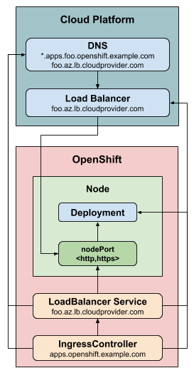
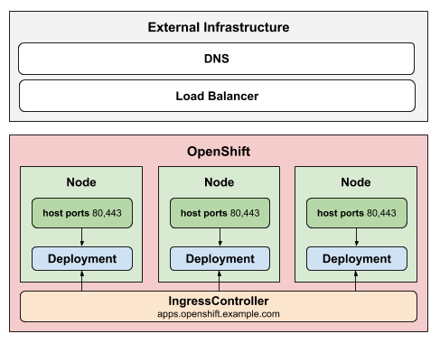
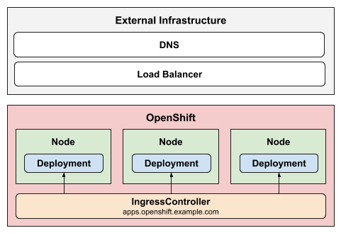

# OpenShift Ingress Operator

Ingress Operator is an [OpenShift](https://www.openshift.com) component which enables external access to cluster services by configuring Ingress Controllers, which route traffic as specified by OpenShift [Route](https://docs.openshift.com/container-platform/3.11/architecture/networking/routes.html) and Kubernetes [Ingress](https://kubernetes.io/docs/concepts/services-networking/ingress/) resources.

To provide this functionality, Ingress Operator deploys and manages an
[OpenShift router](https://github.com/openshift/router) — a
[HAProxy-based](https://www.haproxy.com) Kubernetes [ingress
controller](https://kubernetes.io/docs/concepts/services-networking/ingress-controllers).

Ingress Operator implements the OpenShift [ingresscontroller API](https://github.com/openshift/api/blob/master/operator/v1/types_ingress.go).

## Installing

Ingress Operator is a core feature of OpenShift and is enabled out of the box.

Every new [OpenShift installation](https://github.com/openshift/installer)
 has an `ingresscontroller` named `default` which can be customized,
replaced, or supplemented with additional ingress controllers. To view the
default ingress controller, use the `oc` command:

```shell
$ oc describe --namespace=openshift-ingress-operator ingresscontroller/default
```

## Managing

Create and edit `ingresscontroller.operator.openshift.io` resources to manage
ingress controllers.

Interact with ingress controllers using the `oc` command. Every ingress
controller lives in the `openshift-ingress-operator` namespace.

To scale an ingress controller:

```shell
$ oc scale \
   --namespace=openshift-ingress-operator \
   --replicas=1 \
   ingresscontroller/<name>

$ oc patch \
   --namespace=openshift-ingress-operator \
   --patch='{"spec": {"replicas": 2}}' \
   --type=merge \
   ingresscontroller/<name>
```

**Note:** Using `oc scale` on an `ingresscontroller` where `.spec.replicas` is unset will currently return an error ([Kubernetes #75210](https://github.com/kubernetes/kubernetes/pull/75210)).

## Customizing

Create new `ingresscontroller` resources in the `openshift-ingress-operator`
namespace.

To edit an existing ingress controller:

```shell
$ oc edit --namespace=openshift-ingress-operator ingresscontroller/<name>
```

**Important:** Updating an ingress controller may lead to disruption for public
facing network connections as a new ingress controller revision may be rolled
out.

Refer to the [ingresscontroller API](https://github.com/openshift/api/blob/master/operator/v1/types_ingress.go) for full details on defaults and
customizing an ingress controller. The most important initial customizations are
domain and endpoint publishing strategy, as they *cannot currently be changed
after the ingress controller is created*.

### Endpoint publishing

The `.spec.endpointPublishingStrategy` field is used to publish the ingress
controller endpoints to other networks, enable load balancer integrations, etc.

Every strategy is described in detail in the [ingresscontroller API](https://github.com/openshift/api/blob/master/operator/v1/types_ingress.go). A brief
design diagram for each is shown below.

#### LoadBalancerService

The `LoadBalancerService` strategy publishes an ingress controller using a
Kubernetes [LoadBalancer
Service](https://kubernetes.io/docs/concepts/services-networking/service/#loadbalancer)
and on some platforms offers managed wildcard DNS.



#### HostNetwork

The `HostNetwork` strategy uses host networking to publish the ingress
controller directly on the node host where the ingress controller is deployed.



#### Private

The `Private` strategy does not publish the ingress controller.



## Troubleshooting

Use the `oc` command to troubleshoot operator issues.

To inspect the operator's status:

```shell
$ oc describe clusteroperators/ingress
```

To view the operator's logs:

```shell
$ oc logs --namespace=openshift-ingress-operator deployments/ingress-operator
```

To inspect the status of a particular ingress controller:

```shell
$ oc describe --namespace=openshift-ingress-operator ingresscontroller/<name>
```

## Contributing

Report issues in [Bugzilla](https://bugzilla.redhat.com/enter_bug.cgi?product=OpenShift%20Container%20Platform&version=4.0.0&component=Routing).

See [HACKING.md](HACKING.md) for development topics.
