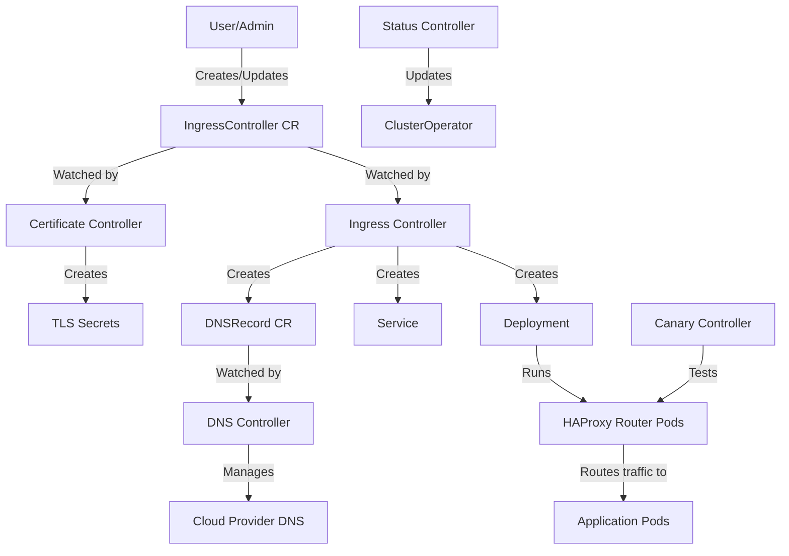
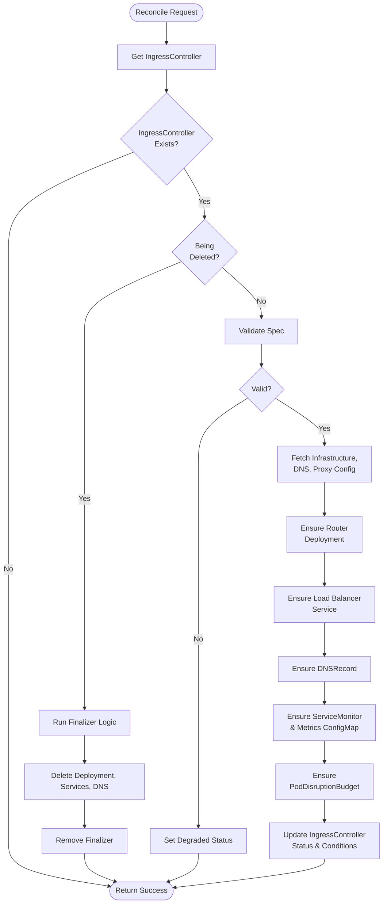
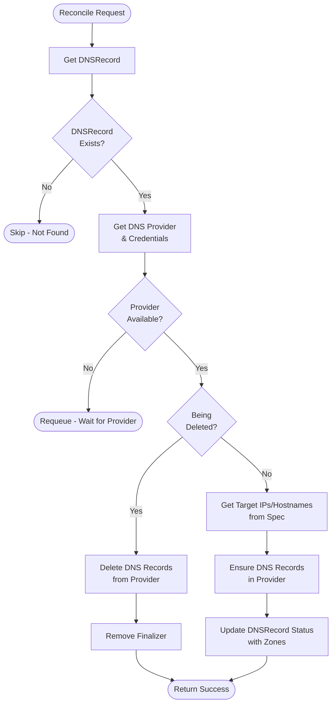
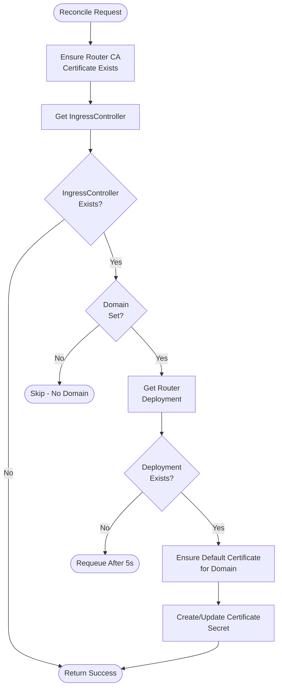
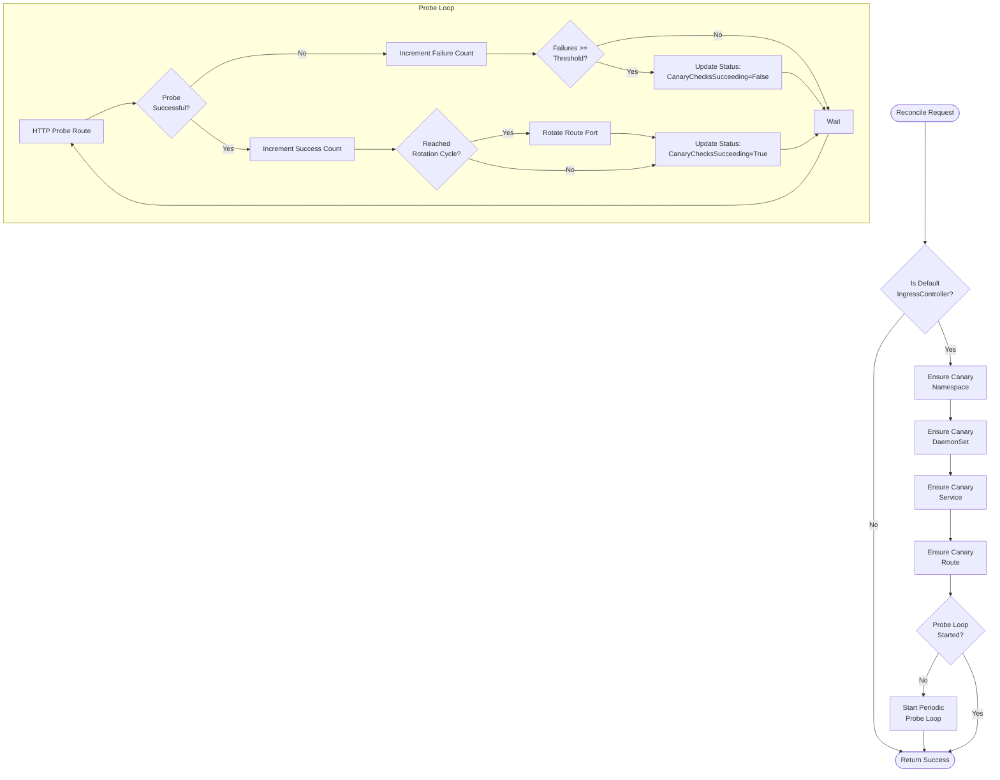
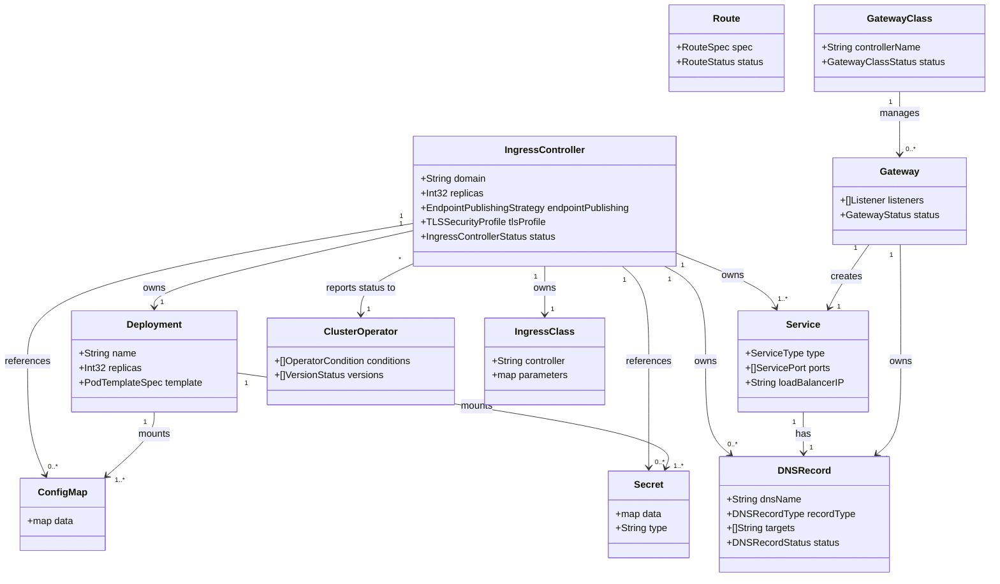

# Project Design: OpenShift Cluster Ingress Operator

## Overview

- **Project Type**: Kubernetes Operator
- **Controllers**: 17
- **Custom Resources**: 2 (IngressController, DNSRecord)
- **Managed Resources**: Deployment, Service, ConfigMap, Secret, Route, DaemonSet, PodDisruptionBudget, IngressClass, Gateway, GatewayClass
- **Binary Name**: `ingress-operator`
- **Primary Purpose**: Manages ingress controllers for OpenShift clusters, enabling external access to cluster services via Route and Ingress resources

## Architecture

The OpenShift Cluster Ingress Operator is responsible for deploying and managing HAProxy-based ingress controllers in OpenShift clusters. It implements the IngressController API and coordinates multiple controllers to handle DNS, certificates, monitoring, and gateway functionality.

### High-Level Component Relationships

---

## Controllers

### Controller: Ingress Controller

**File**: `pkg/operator/controller/ingress/controller.go`

**Reconciles**: `IngressController` (operator.openshift.io/v1)

**Description**: The primary controller that manages the lifecycle of ingress controller deployments. Creates and manages router deployments, services, monitoring resources, and DNS records based on IngressController specifications.

**Watches**:
- `IngressController` (primary resource)
- `Deployment` (owned - router deployments)
- `Service` (owned - load balancer and nodeport services)
- `Pod` (delete events only - for cleanup)
- `DNSRecord` (owned - DNS entries)
- `DNS` (config.openshift.io - cluster DNS configuration)
- `Ingress` (config.openshift.io - cluster ingress configuration)
- `Proxy` (config.openshift.io - cluster proxy settings)
- `Infrastructure` (config.openshift.io - platform configuration)

**Operations**:
- **Creates**: Deployment, Service (LoadBalancer/NodePort/Internal), ConfigMap (metrics, rsyslog), ServiceMonitor, PodDisruptionBudget, DNSRecord, ClusterRole, ClusterRoleBinding
- **Reads**: IngressController, Infrastructure, DNS, Ingress, Proxy, Deployment, Service
- **Updates**: IngressController status, Deployment, Service, ConfigMap
- **Deletes**: Deployment, Service, ConfigMap (on cleanup)

**Key Responsibilities**:
- Ensures router deployment exists with correct configuration
- Manages load balancer service for external access
- Creates internal service for intra-cluster routing
- Configures metrics and monitoring via ServiceMonitor
- Creates PodDisruptionBudget for high availability
- Updates IngressController status with conditions
- Handles scaling and replica management

**Reconciliation Flow**:

---

### Controller: DNS Controller

**File**: `pkg/operator/controller/dns/controller.go`

**Reconciles**: `DNSRecord` (ingress.operator.openshift.io/v1)

**Description**: Manages DNS records in cloud provider DNS services (AWS Route53, Azure DNS, GCP Cloud DNS, IBM Cloud DNS) for ingress controller endpoints.

**Watches**:
- `DNSRecord` (primary resource, with GenerationChangedPredicate)
- `DNS` (config.openshift.io - DNS configuration changes)
- `Infrastructure` (config.openshift.io - platform changes)
- `Secret` (cloud-credentials - credential updates only)

**Operations**:
- **Creates**: DNS records in cloud provider
- **Reads**: DNSRecord, DNS config, Infrastructure, cloud-credentials Secret
- **Updates**: DNSRecord status, DNS records in cloud provider
- **Deletes**: DNS records in cloud provider (on cleanup)

**Key Responsibilities**:
- Creates DNS records pointing to ingress controller load balancer IPs
- Manages wildcard DNS entries for routes
- Handles DNS record lifecycle (create, update, delete)
- Updates DNSRecord status with published zones
- Supports multiple cloud providers (AWS, Azure, GCP, IBM)

**Reconciliation Flow**:

---

### Controller: Certificate Controller

**File**: `pkg/operator/controller/certificate/controller.go`

**Reconciles**: `IngressController` (operator.openshift.io/v1)

**Description**: Manages self-signed certificates for ingress controllers that don't have user-provided certificates.

**Watches**:
- `IngressController` (primary resource)

**Operations**:
- **Creates**: Secret (router CA, default certificate)
- **Reads**: IngressController, Deployment (router deployment)
- **Updates**: Secret (certificate renewal)

**Key Responsibilities**:
- Ensures router CA certificate exists
- Creates default self-signed certificate for each ingress controller
- Certificates are scoped to the ingress controller's domain
- Manages certificate as Secret with deployment owner reference

**Reconciliation Flow**:

---

### Controller: Certificate Publisher Controller

**File**: `pkg/operator/controller/certificate-publisher/controller.go`

**Reconciles**: `IngressController` (operator.openshift.io/v1)

**Description**: Publishes router CA certificates to well-known ConfigMaps for consumption by other cluster components.

**Watches**:
- `IngressController`
- `Secret` (router CA certificates)

**Operations**:
- **Creates**: ConfigMap (router-ca in openshift-config-managed)
- **Reads**: IngressController, Secret (router-ca)
- **Updates**: ConfigMap (router-ca bundle)

**Key Responsibilities**:
- Publishes router CA bundle to cluster-wide ConfigMap
- Makes CA certificates available to other components (console, oauth, etc.)
- Keeps ConfigMap synchronized with CA Secret changes

---

### Controller: Canary Controller

**File**: `pkg/operator/controller/canary/controller.go`

**Reconciles**: `IngressController` (default only)

**Description**: Performs continuous health checks of the default ingress controller by deploying a canary application and probing it through the ingress.

**Watches**:
- `IngressController` (default only, via predicate)
- `Route` (canary route)
- `DaemonSet` (canary daemonset)
- `Service` (canary service)

**Operations**:
- **Creates**: Namespace, DaemonSet (canary server), Service, Route
- **Reads**: IngressController, Route, DaemonSet, Service
- **Updates**: IngressController status (CanaryChecksSucceeding condition), Route (port rotation)
- **Deletes**: Namespace, DaemonSet, Service, Route (on cleanup)

**Key Responsibilities**:
- Deploys canary workload (DaemonSet) with HTTP server
- Creates Route pointing to canary service
- Periodically probes canary route through ingress controller
- Updates IngressController status based on probe results
- Rotates canary endpoint ports to verify route updates
- Sets degraded status if canary checks fail repeatedly

**Reconciliation Flow**:

---

### Controller: Status Controller

**File**: `pkg/operator/controller/status/controller.go`

**Reconciles**: `IngressController` (default - but updates ClusterOperator)

**Description**: Aggregates status from all ingress controllers and updates the ClusterOperator resource to report operator health to the cluster.

**Watches**:
- `IngressController`
- `ClusterOperator` (ingress cluster operator)
- `Subscription` (OLM subscriptions for Gateway API conflicts)

**Operations**:
- **Creates**: ClusterOperator (if doesn't exist)
- **Reads**: IngressController (all instances), Subscription (OSSM subscriptions)
- **Updates**: ClusterOperator status (conditions, versions, related objects)

**Key Responsibilities**:
- Creates and maintains ClusterOperator resource
- Aggregates Available/Progressing/Degraded conditions from all IngressControllers
- Reports operator and operand versions
- Lists related objects (CRDs, namespaces, etc.)
- Detects conflicting OLM subscriptions for Gateway API
- Provides cluster-wide operator health status

---

### Controller: Route Metrics Controller

**File**: `pkg/operator/controller/route-metrics/controller.go`

**Reconciles**: `IngressController`

**Description**: Collects and exposes Prometheus metrics about routes served by ingress controllers.

**Watches**:
- `IngressController`
- `Route`

**Operations**:
- **Reads**: IngressController, Route (all routes in cluster)
- **Exposes**: Prometheus metrics about route count, admission status

**Key Responsibilities**:
- Counts routes per ingress controller
- Tracks route admission status
- Exposes metrics for monitoring/alerting

---

### Controller: IngressClass Controller

**File**: `pkg/operator/controller/ingressclass/controller.go`

**Reconciles**: `IngressController`

**Description**: Creates and manages IngressClass resources for each IngressController, enabling Kubernetes Ingress API support.

**Watches**:
- `IngressController`

**Operations**:
- **Creates**: IngressClass (per IngressController)
- **Reads**: IngressController
- **Updates**: IngressClass
- **Deletes**: IngressClass (on cleanup)

**Key Responsibilities**:
- Ensures IngressClass exists for each IngressController
- Sets default IngressClass annotation if appropriate
- Enables Kubernetes Ingress resources to target specific ingress controllers

---

### Controller: Configurable Route Controller

**File**: `pkg/operator/controller/configurable-route/controller.go`

**Reconciles**: Routes for cluster services (console, downloads, etc.)

**Description**: Manages routes for cluster infrastructure services with optional custom certificates.

**Watches**:
- `Route`
- `Secret` (user-provided certificates)

**Operations**:
- **Reads**: Route, Secret (certificates)
- **Updates**: Route (with custom certificates)

**Key Responsibilities**:
- Applies user-provided certificates to cluster service routes
- Manages TLS configuration for console and downloads routes

---

### Controller: Client CA ConfigMap Controller

**File**: `pkg/operator/controller/clientca-configmap/controller.go`

**Reconciles**: `ConfigMap` (client CA bundles)

**Description**: Synchronizes client CA ConfigMaps from user namespace to operand namespace for mutual TLS support.

**Watches**:
- `ConfigMap` (client CA in openshift-config)

**Operations**:
- **Reads**: ConfigMap (source)
- **Creates/Updates**: ConfigMap (target in openshift-ingress)

**Key Responsibilities**:
- Copies client CA bundles to ingress namespace
- Enables mutual TLS for routes

---

### Controller: CRL Controller

**File**: `pkg/operator/controller/crl/controller.go`

**Reconciles**: `IngressController`

**Description**: Manages Certificate Revocation Lists (CRLs) for client certificate validation.

**Watches**:
- `IngressController`
- `ConfigMap` (CRL data)

**Operations**:
- **Creates/Updates**: ConfigMap (CRL bundle)
- **Reads**: IngressController, ConfigMap (source CRL)

**Key Responsibilities**:
- Publishes CRL bundles for router pods
- Enables certificate revocation checking

---

### Controller: Sync HTTP Error Code ConfigMap Controller

**File**: `pkg/operator/controller/sync-http-error-code-configmap/controller.go`

**Reconciles**: `IngressController`

**Description**: Synchronizes custom HTTP error page ConfigMaps to router namespaces.

**Watches**:
- `IngressController`
- `ConfigMap` (error pages)

**Operations**:
- **Reads**: IngressController, ConfigMap (error pages in openshift-config)
- **Creates/Updates**: ConfigMap (error pages in openshift-ingress)

**Key Responsibilities**:
- Copies custom error page ConfigMaps to router namespace
- Enables custom HTTP error responses (503, 404, etc.)

---

### Controller: Monitoring Dashboard Controller

**File**: `pkg/operator/controller/monitoring-dashboard/controller.go`

**Reconciles**: Infrastructure (cluster singleton)

**Description**: Creates Grafana dashboard ConfigMaps for ingress/route monitoring.

**Watches**:
- `Infrastructure` (config.openshift.io)

**Operations**:
- **Creates/Updates**: ConfigMap (Grafana dashboards in openshift-config-managed)

**Key Responsibilities**:
- Publishes monitoring dashboards for ingress metrics
- Integrates with OpenShift monitoring stack

---

### Gateway API Controllers

The operator includes three controllers for Gateway API support:

#### GatewayClass Controller

**File**: `pkg/operator/controller/gatewayclass/controller.go`

**Reconciles**: `GatewayClass` (gateway.networking.k8s.io/v1)

**Description**: Manages Gateway API implementation by installing Istio/OSSM via OLM subscriptions.

**Operations**:
- **Creates**: Subscription (OSSM3), Istio CR
- **Reads**: GatewayClass, Subscription
- **Updates**: GatewayClass status

**Key Responsibilities**:
- Installs Gateway API implementation (Istio) when GatewayClass is created
- Manages OLM subscription and Istio custom resource
- Updates GatewayClass accepted status

#### Gateway Service DNS Controller

**File**: `pkg/operator/controller/gateway-service-dns/controller.go`

**Reconciles**: `Gateway` (gateway.networking.k8s.io/v1)

**Description**: Creates DNSRecord resources for Gateway services to enable external DNS.

**Operations**:
- **Creates**: DNSRecord (for Gateway load balancer services)
- **Reads**: Gateway, Service
- **Updates**: DNSRecord

**Key Responsibilities**:
- Ensures DNS records for Gateway endpoints
- Similar to ingress controller DNS management

#### Gateway Labeler Controller

**File**: `pkg/operator/controller/gateway-labeler/controller.go`

**Reconciles**: `Gateway` (gateway.networking.k8s.io/v1)

**Description**: Labels Gateway resources to track their creation source.

**Operations**:
- **Reads**: Gateway
- **Updates**: Gateway (labels)

**Key Responsibilities**:
- Adds metadata labels to Gateway resources
- Helps identify Gateways managed by this operator

#### GatewayAPI Controller

**File**: `pkg/operator/controller/gatewayapi/controller.go`

**Reconciles**: `Infrastructure` (config.openshift.io)

**Description**: Orchestrates Gateway API functionality by installing CRDs and starting dependent controllers when feature gates are enabled.

**Operations**:
- **Creates**: CustomResourceDefinition (Gateway API CRDs)
- **Reads**: Infrastructure, FeatureGate
- **Starts**: GatewayClass, Gateway Service DNS, Gateway Labeler controllers

**Key Responsibilities**:
- Installs Gateway API CRDs when feature gate enabled
- Starts Gateway-related controllers dynamically
- Coordinates Gateway API implementation lifecycle

---

## Resource Relationships

---

## Custom Resource Definitions

### IngressController

- **API Group**: `operator.openshift.io`
- **Versions**: v1 (storage version)
- **Scope**: Namespaced
- **Plural Name**: `ingresscontrollers`
- **Description**: Describes a managed ingress controller for the cluster. The controller can service OpenShift Route and Kubernetes Ingress resources.

**Key Fields**:
- `spec.domain`: Base domain for routes served by this ingress controller
- `spec.replicas`: Number of router pods to run
- `spec.endpointPublishingStrategy`: How to expose the ingress controller (LoadBalancer, NodePort, HostNetwork, Private)
- `spec.nodePlacement`: Node selector and tolerations for router pods
- `spec.tlsSecurityProfile`: TLS version and cipher configuration
- `spec.routeSelector`: Label selector to filter routes served
- `status.conditions`: Current state (Available, Degraded, Progressing, etc.)
- `status.domain`: Observed domain
- `status.endpointPublishingStrategy`: Observed publishing strategy

**Managed By**: Ingress Controller, Certificate Controller, Status Controller, Canary Controller

---

### DNSRecord

- **API Group**: `ingress.operator.openshift.io`
- **Versions**: v1
- **Scope**: Namespaced
- **Plural Name**: `dnsrecords`
- **Description**: Represents a DNS record that should be created in the cloud provider's DNS service.

**Key Fields**:
- `spec.dnsName`: Fully qualified domain name for the DNS record
- `spec.recordType`: Type of DNS record (A, AAAA, CNAME)
- `spec.targets`: IP addresses or hostnames for the record
- `spec.recordTTL`: TTL for the DNS record
- `status.zones`: DNS zones where the record has been published

**Managed By**: DNS Controller

---

## RBAC Permissions

### ServiceAccount: `ingress-operator`

**Namespace**: `openshift-ingress-operator`

**Permissions** (via ClusterRole `openshift-ingress-operator`):

| API Group | Resources | Verbs |
|-----------|-----------|-------|
| `` (core) | configmaps, namespaces, serviceaccounts, endpoints, services, secrets, pods, events | * (all) |
| `` (core) | pods/eviction | create |
| `` (core) | nodes | list |
| `apps` | deployments, daemonsets | * (all) |
| `policy` | poddisruptionbudgets | * (all) |
| `monitoring.coreos.com` | servicemonitors | create, get, update |
| `rbac.authorization.k8s.io` | clusterroles, clusterrolebindings, roles, rolebindings | create, get, list, watch, update |
| `operator.openshift.io` | ingresscontrollers, ingresscontrollers/status | * (all) |
| `ingress.operator.openshift.io` | dnsrecords, dnsrecords/status | * (all) |
| `config.openshift.io` | infrastructures, ingresses, dnses, featuregates, apiservers, networks, clusterversions, proxies | get, list, watch |
| `config.openshift.io` | infrastructures/status, ingresses/status | update |
| `config.openshift.io` | clusteroperators, clusteroperators/status | create, get, list, watch, update (status only) |
| `route.openshift.io` | routes, routes/custom-host, routes/status | * (all) |
| `networking.k8s.io` | ingressclasses | * (all) |
| `gateway.networking.k8s.io` | gateways, gatewayclasses, httproutes, referencegrants, gateways/status, gatewayclasses/status, httproutes/status | * (all) |
| `operators.coreos.com` | subscriptions, installplans, clusterserviceversions | create, get, list, watch, update, delete |
| `sailoperator.io` | istios | create, get, list, watch, update, delete |
| `apiextensions.k8s.io` | customresourcedefinitions | create, get, list, watch |

**Note**: The operator has broad permissions as it manages many cluster resources and integrates with multiple subsystems (DNS, certificates, monitoring, Gateway API).

---

## Entry Points

### Main Package

**File**: `cmd/ingress-operator/main.go`

**Binary**: `ingress-operator`

### Commands

#### `start`

Starts the operator in the foreground, watching for IngressController resources and managing ingress infrastructure.

**Flags**:
- `--namespace` (required): Namespace the operator is deployed to (default: `openshift-ingress-operator`)
- `--image` (required): Image of the ingress controller (HAProxy router) to manage
- `--canary-image`: Image of the canary container for health checks
- `--release-version` (required): Release version the operator should converge to
- `--metrics-listen-addr`: Metrics endpoint address (default: `127.0.0.1:60000`)
- `--shutdown-file`: If this file changes, operator shuts down (default: `/etc/pki/ca-trust/extracted/pem/tls-ca-bundle.pem`)
- `--gateway-api-operator-catalog`: Catalog source for Gateway API implementation (default: `redhat-operators`)
- `--gateway-api-operator-channel`: Release channel for Gateway API operator (default: `stable`)
- `--gateway-api-operator-version`: Version of Gateway API operator to install (default: `servicemeshoperator3.v3.2.0`)
- `--istio-version`: Istio version to install (default: `v1.27.3`)

**Controllers Registered** (in order):
1. Ingress Controller
2. Configurable Route Controller
3. Status Controller
4. Certificate Controller
5. Error Page ConfigMap Controller
6. Certificate Publisher Controller
7. Client CA ConfigMap Controller
8. CRL Controller
9. DNS Controller
10. IngressClass Controller
11. Canary Controller (if `--canary-image` provided)
12. Route Metrics Controller
13. Monitoring Dashboard Controller
14. GatewayClass Controller (unmanaged - started by GatewayAPI controller)
15. Gateway Service DNS Controller (unmanaged - started by GatewayAPI controller)
16. Gateway Labeler Controller (unmanaged - started by GatewayAPI controller)
17. GatewayAPI Controller (manages Gateway API lifecycle)

#### `render`

Renders static manifests for installation (used by installer).

#### `serve-healthcheck`

Serves health check endpoint for the canary daemonset.

#### `serve-grpc-test-server`

Runs a gRPC interoperability test server for testing.

#### `serve-http2-test-server`

Runs an HTTP/2 test server for testing.

---

## Configuration

The operator is configured via:

1. **Command-line flags** (see Entry Points section)
2. **IngressController Custom Resources** (user-facing API)
3. **Cluster-scoped configuration resources**:
   - `config.openshift.io/Infrastructure` (platform configuration)
   - `config.openshift.io/DNS` (cluster DNS configuration)
   - `config.openshift.io/Ingress` (ingress defaults)
   - `config.openshift.io/Proxy` (cluster proxy settings)
   - `config.openshift.io/FeatureGate` (feature gate enablement)

4. **Secrets**:
   - `cloud-credentials` (cloud provider credentials for DNS management)

5. **ConfigMaps**:
   - `trusted-ca` (cluster trusted CA bundle)
   - `kube-cloud-config` (cloud-specific configuration)

---

## Key Workflows

### Creating a New IngressController

1. User creates `IngressController` CR in `openshift-ingress-operator` namespace
2. Ingress Controller reconciles and creates:
   - Deployment (router pods with HAProxy)
   - Service (LoadBalancer, NodePort, or ClusterIP based on `endpointPublishingStrategy`)
   - ServiceMonitor (for metrics)
   - PodDisruptionBudget (for HA)
   - DNSRecord (for external DNS)
3. DNS Controller reconciles DNSRecord and creates DNS entries in cloud provider
4. Certificate Controller creates default TLS certificate if not provided
5. IngressClass Controller creates IngressClass resource
6. Status Controller updates ClusterOperator with new ingress controller status
7. Router pods start and begin serving Routes/Ingresses

### DNS Management Flow

1. Ingress Controller creates DNSRecord with target (load balancer IP or hostname)
2. DNS Controller watches DNSRecord creation/update
3. DNS Controller fetches cloud credentials from Secret
4. DNS Controller calls cloud provider API (Route53, Azure DNS, etc.) to create/update DNS record
5. DNS Controller updates DNSRecord status with published zones
6. End users can now resolve the ingress domain to the load balancer

### Certificate Lifecycle

1. Certificate Controller checks if IngressController has custom certificate
2. If no custom cert, Certificate Controller ensures router CA exists
3. Certificate Controller generates self-signed certificate for the ingress controller's domain
4. Certificate is stored as Secret with owner reference to router Deployment
5. Router Deployment mounts Secret and uses certificate for TLS
6. Certificate Publisher publishes CA to cluster-wide ConfigMap (`router-ca` in `openshift-config-managed`)
7. Other components (console, oauth) trust the published CA

### Canary Health Checks (Default IngressController Only)

1. Canary Controller creates:
   - Namespace: `openshift-ingress-canary`
   - DaemonSet: Runs canary HTTP server on every node
   - Service: Exposes canary pods
   - Route: Points to canary service through default ingress controller
2. Canary Controller starts periodic probe loop (every 1 minute)
3. Controller makes HTTP request to canary route (through ingress)
4. If probe succeeds: Increment success counter
5. If 5 consecutive successes: Optionally rotate canary endpoint port
6. If probe fails: Increment failure counter
7. If 5 consecutive failures: Set `CanaryChecksSucceeding=False` on IngressController
8. Status Controller propagates canary status to ClusterOperator

---

## Implementation Notes

### Controller-Runtime Patterns

- All controllers use `sigs.k8s.io/controller-runtime`
- Controllers are created with `controller.New()` and registered via `Watch()`
- Predicates are used to filter events (e.g., `GenerationChangedPredicate`, name filters)
- Mapping functions (`handler.EnqueueRequestsFromMapFunc`) are used to trigger reconciliation from related resources
- Owner references are used for garbage collection (e.g., Deployment owns router Pods)

### Error Handling

- Retryable errors return `reconcile.Result{RequeueAfter: duration}` for backoff
- Permanent errors return `reconcile.Result{}` and update resource status
- Status conditions follow Kubernetes conventions (Available, Progressing, Degraded)

### Multi-Cloud DNS Support

The DNS controller abstracts cloud provider DNS APIs via the `dns.Provider` interface:
- AWS: Route53
- Azure: Azure DNS
- GCP: Cloud DNS
- IBM: Public CIS and Private DNSServices
- Split DNS: Supports both public and private zones

### Gateway API Integration

Gateway API support is opt-in via feature gates:
- `GatewayAPI`: Enables Gateway API CRD installation
- `GatewayAPIController`: Enables Istio/OSSM installation and Gateway reconciliation

The operator installs OSSM3 (OpenShift Service Mesh 3) via OLM when a GatewayClass is created.

---

## Testing

The operator includes extensive test infrastructure:

- **Unit tests**: Controller logic, manifest generation
- **Integration tests**: E2E scenarios with real Kubernetes API
- **Canary tests**: HTTP server for canary health checks
- **gRPC and HTTP/2 test servers**: Protocol compliance testing

Test utilities are located in `pkg/operator/controller/test/`

---

## Observability

### Metrics

The operator exposes Prometheus metrics on port 60000:
- Canary check metrics (`ingress_canary_*`)
- Route metrics (`route_metrics_*`)
- Controller reconciliation metrics (from controller-runtime)

### Monitoring

- ServiceMonitor resources enable Prometheus scraping
- Grafana dashboards are created by Monitoring Dashboard Controller
- PrometheusRule defines alerts for operator health

### Logging

- Structured logging via `logr` interface
- Log level controlled by controller-runtime flags
- Request-scoped logging in reconciliation loops

---

## Notes

This document was generated by `/doc:controller-design` on 2026-01-09.

For implementation details and source code, see:
- Controllers: `pkg/operator/controller/`
- Manifests: `manifests/`
- Main entry point: `cmd/ingress-operator/main.go`
- Operator setup: `pkg/operator/operator.go`

For user-facing documentation, see the main [README.md](../README.md)
